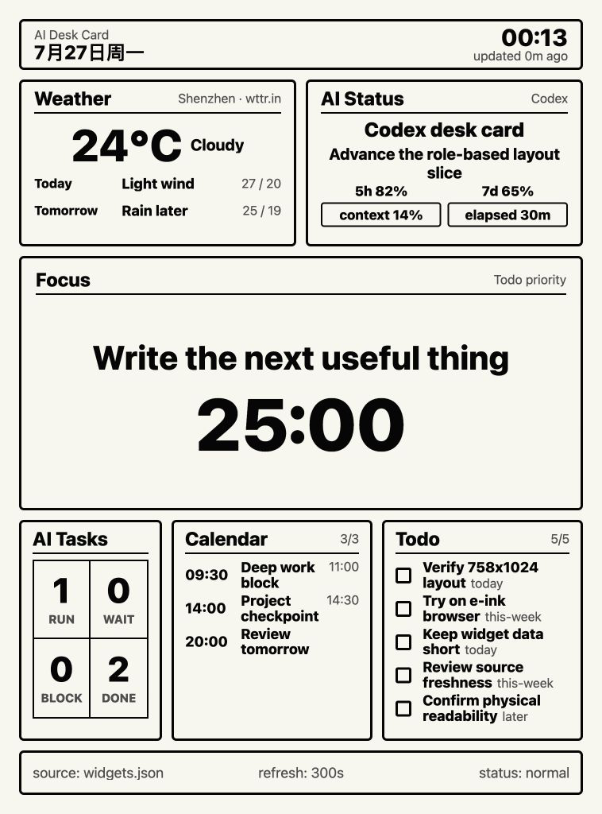

# AI Desk Card Online

[English](README.md) | **简体中文**

[](https://github.com/Ethereal49/ai-desk-card-online/actions/workflows/ci.yml)
[](LICENSE)
[](https://www.python.org/downloads/)
[](https://developer.mozilla.org/en-US/docs/Web/JavaScript)
[](CONTRIBUTING.md)

一个面向 `758x1024` 墨水屏浏览器的静态信息看板，强调隐私保护。

AI Desk Card Online 将少量经过明确裁剪的信息转化为桌面环境信息屏。
浏览器只渲染纯 HTML、CSS、JavaScript 和 `widgets.json`；没有前端构建步骤，
也没有应用服务器。



## 项目初衷

大多数仪表盘针对交互和信息密度优化。本项目针对 30–50 cm 距离的一瞥优化：

- 固定的竖向显示区域，在目标 viewport 下无需滚动；
- 高对比度、大字号，无动画或装饰效果；
- 六个内容有界且数据源归属明确的 widget；
- 数据缺失、过期或暂时离线时仍能可靠渲染；
- 隐私边界只发布渲染所需字段，不发布原始数据源记录。

## 架构

```text
read-only sources
  -> bounded privacy projection
  -> last-known-good merge and Focus resolution
  -> widgets.json
  -> static browser dashboard
```

生产部署可以通过 SSH 发布五个由本地端维护的 widget，天气由服务器定时任务负责。
加锁的安装器会重新读取线上文档，保留服务器负责的 `weather`，验证完整 payload
后原子安装。

## Widgets

| Widget | 用途 | 最大公开细节 |
| --- | --- | --- |
| `weather` | 当前天气和预报 | 当前天气加两行预报 |
| `ai-status` | AI 会话和额度摘要 | 经过裁剪的状态字段 |
| `focus` | 一个当前重点 | 一个选定的投影结果 |
| `ai-tasks` | AI 工作状态统计 | 四项汇总计数 |
| `calendar` | 近期日程 | 最多四个裁剪后的事件 |
| `todo` | 排序后的下一步事项 | 最多五个裁剪后的事项 |

稳定的顶层数据契约是：
`updated_at`、`layout`、`refresh_seconds` 和 `widgets`。请参阅
[公开示例](web/widgets.example.json)和详细的
[Web 数据契约](web/README.md)。

## 快速开始

要求：Python 3.11+ 和现代浏览器。

```bash
git clone https://github.com/Ethereal49/ai-desk-card-online.git
cd ai-desk-card-online
python3 -m http.server 4173 --directory web
```

打开 <http://127.0.0.1:4173/>。仓库中的 `web/widgets.json` 是安全的演示
数据；`web/widgets.example.json` 记录了相同的公开数据结构。

如需隔离的示例数据预览：

```bash
temporary_dir="$(mktemp -d)"
cp -R web/. "$temporary_dir/"
cp web/widgets.example.json "$temporary_dir/widgets.json"
python3 -m http.server 4173 --directory "$temporary_dir"
```

停止服务器后删除临时目录。

## 真实数据与隐私

真实数据源刷新是可选的。它读取本地 Linear、Apple Calendar 和 Codex metadata，
然后只投影白名单允许的显示字段。配置从环境变量或被 Git 忽略、权限为 `0600`
的 `.env.local` 加载：

```text
LINEAR_API_KEY=<read-only API key>
AI_DESK_CARD_CALENDARS=["Work","Personal"]
AI_DESK_CARD_SSH_HOST=card-host
```

逐阶段执行数据源检查和发布：

```bash
scripts/refresh_dashboard.py --source-check
scripts/refresh_dashboard.py --preview
scripts/refresh_dashboard.py --publish
```

`--source-check` 不需要 SSH host。远程 preview 或 publish 需要
`AI_DESK_CARD_SSH_HOST` 或 `--host`；缺少远程配置时会在连接 SSH 前直接失败。

切勿将 token、credential、transcript、prompt、response、source ID、path、
meeting link、attendee 或 private note 放入 `widgets.json`。经过裁剪的真实
标题仍可能敏感，因此私有部署需要 HTTPS 和访问控制。发布真实数据前请阅读
[部署指南](deploy/README.md)。

## 验证

确定性检查只使用 Python、Node.js 和 shell 工具：

```bash
python3 -m unittest discover -s scripts -p 'test_*.py' -v
python3 -m compileall -q scripts .codex/hooks .trellis/scripts deploy/scripts
node --check web/app.js
bash -n deploy/scripts/*.sh
python3 .codex/hooks/ensure_plan_updated.py
git diff --check
```

前端或公开截图变更还需要在精确的 `758x1024` 尺寸下完成 Browser 验证，
包括 `scrollHeight <= innerHeight`、全部六个 widget 和请求失败时的 fallback。
实体设备仍是最终的可读性依据。

## 已知限制

- 目前没有稳定且隐私安全的本地数据源能够提供最新 Codex quota window。
  Last-known-good quota 会保持明确的 stale 状态，刷新流程以 `2` 退出。
- 浏览器目前根据初始 `300` 秒 fallback 创建 polling interval。之后非 300 的
  `refresh_seconds` 值会改变标签，但不会重新调度该 interval。
- 如果服务器天气与发布同时变化，`weather.current` Focus 可能落后一个本地
  scheduler tick。
- 不支持 line-clamp 的浏览器会保持内容有界，但可能不显示可见的 ellipsis。

## 项目指南

- [Web 行为和诊断工具](web/README.md)
- [部署和运维指南](deploy/README.md)
- [产品和架构计划](PLAN_web.md)
- [贡献指南](CONTRIBUTING.md)
- [安全策略](SECURITY.md)
- [行为准则](CODE_OF_CONDUCT.md)

## 许可证

[MIT](LICENSE) © 2026 Ethereal49.
